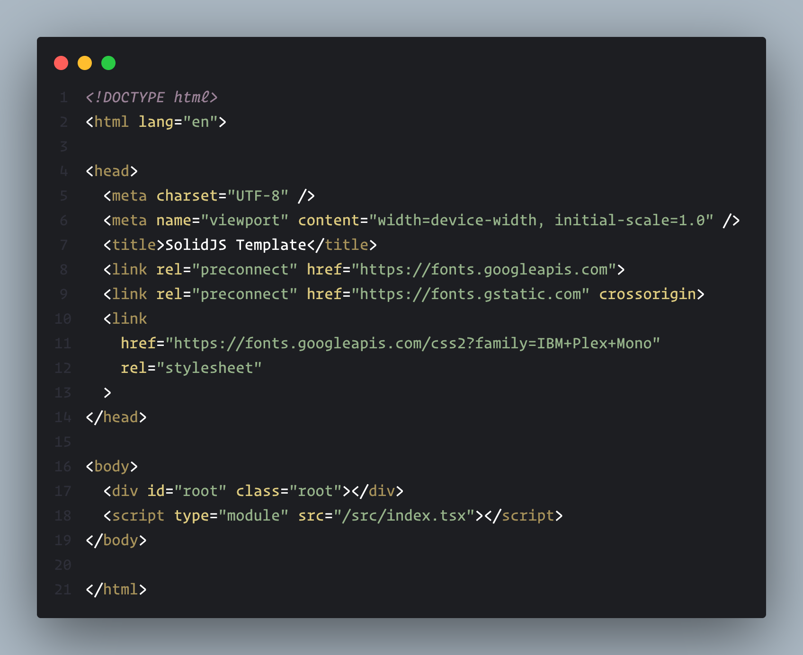
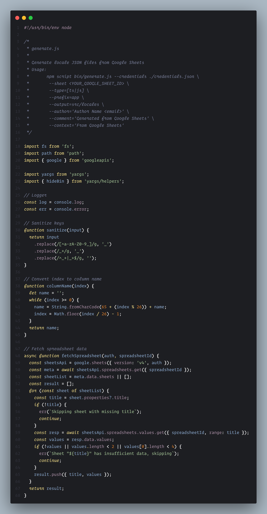
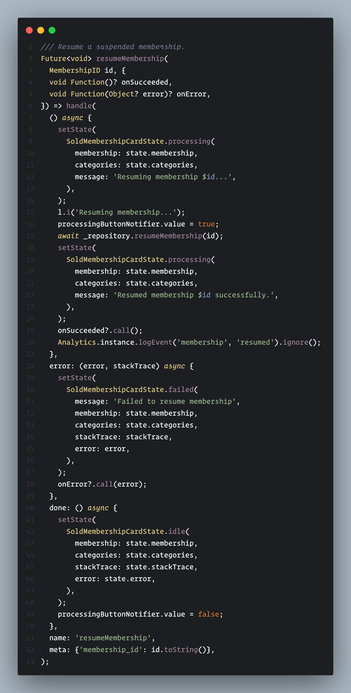

# VS Code CodePen Theme

## Description

A custom theme for Visual Studio Code inspired by the codepen.io online editor theme. Compatible with .HTML, .CSS, .JS, .TS, .JSX, .DART and other formats. Made with ❤️ by ziqq.

## Installing

This extension is available for free in the [Visual Studio Code Marketplace](https://marketplace.visualstudio.com/items?itemName=ziqq.codepen-theme-original)

## Screenshoots

#### HTML

#### SCSS

#### JavaScript

#### DART

