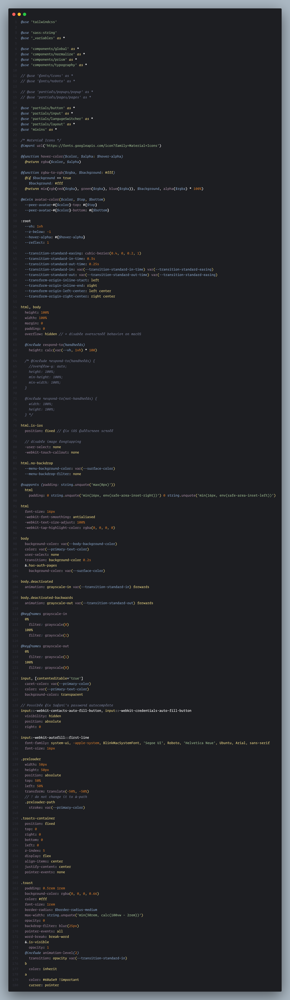
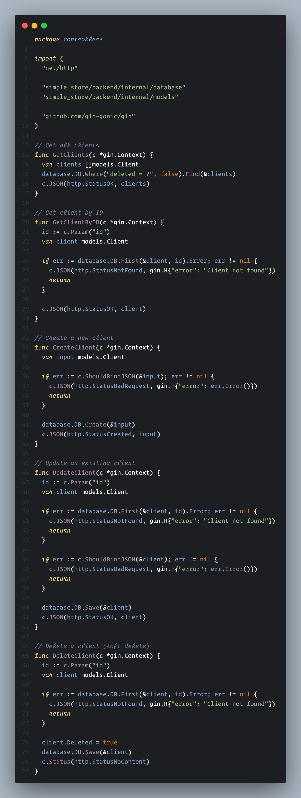
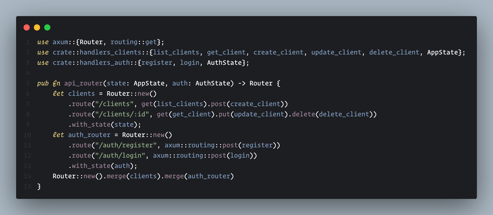
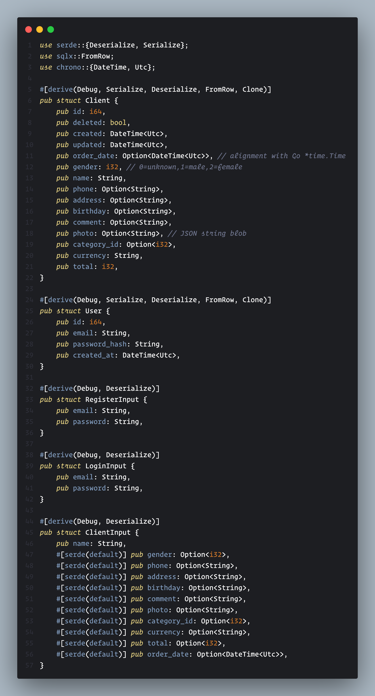
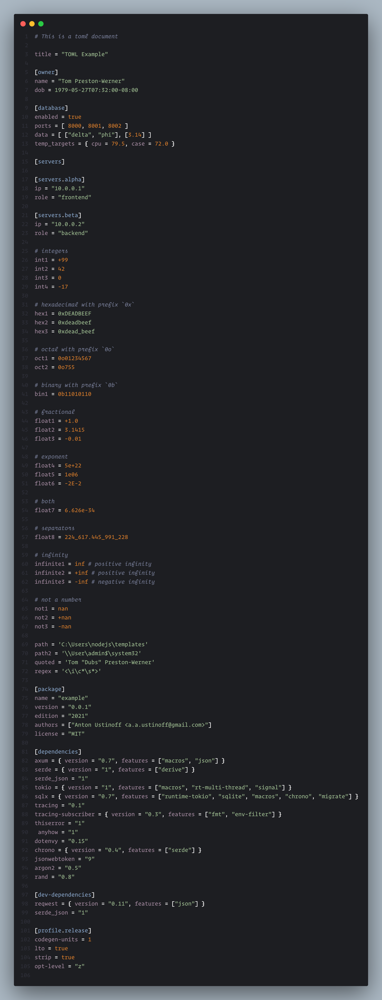
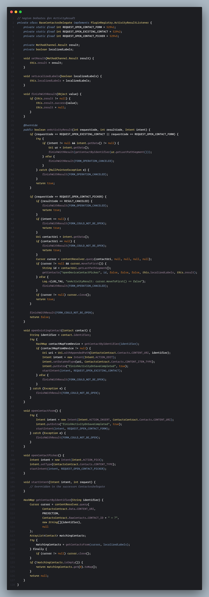
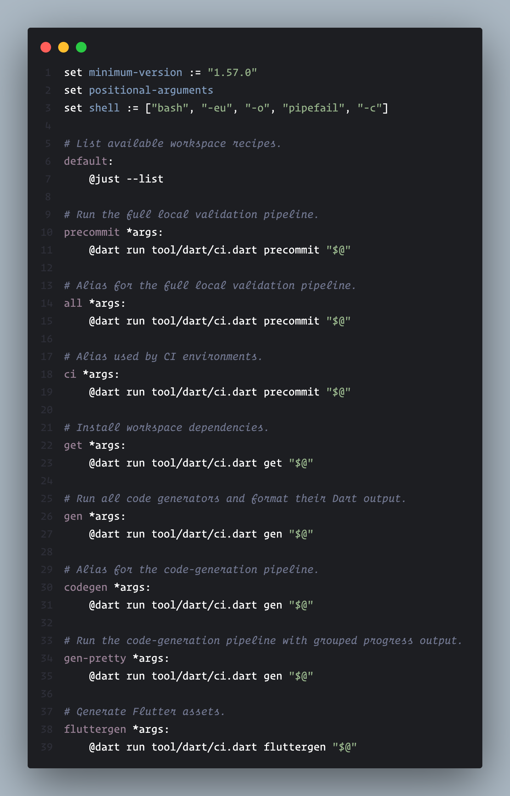
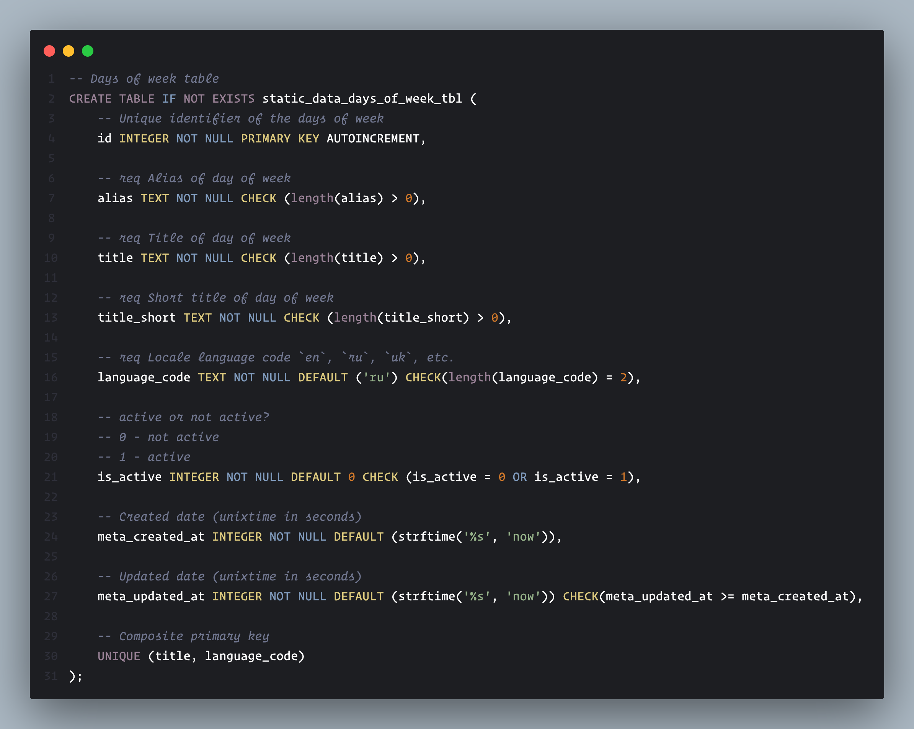
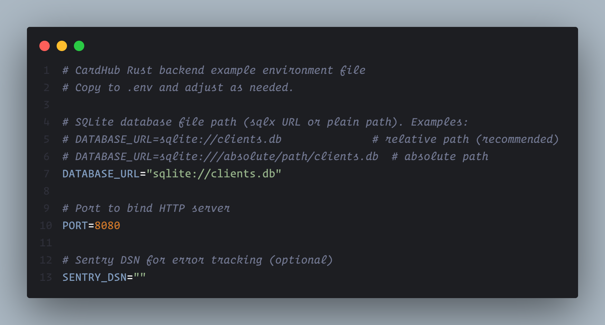

# VS Code CodePen Theme

## Description

A custom theme for Visual Studio Code inspired by the `codepen.io` online editor theme. Compatible with `.HTML`, `.CSS`, `.SASS`, `.SCSS`, `.JS`, `.JSX`, `.TS`, `.TSX`, `.DART`, `.PYTHON`, `.GO`, `.RUST`, `.TOML`, `.SQL`, `.ENV`, `Makefile`, `Justfile` and other formats. Made with 🖤 by ziqq.

## Installing

This extension is available for free in the [Visual Studio Code Marketplace](https://marketplace.visualstudio.com/items?itemName=ziqq.codepen-theme-original)

## Screenshoots

#### HTML

#### SCSS

#### SASS

#### JS

#### DART

#### GO

#### PYTHON

#### RUST

#### TOML

#### JAVA

#### JUSTFILE

#### SQL

#### ENV

