# VS Code CodePen Theme

A dark Visual Studio Code color theme inspired by the CodePen editor. Made with 🖤 by ziqq.

## Installing

Install [CodePen Theme Original](https://marketplace.visualstudio.com/items?itemName=ziqq.codepen-theme-original) from the Visual Studio Code Marketplace, then select **CodePen Theme Original** from **Preferences: Color Theme**. Select **CodePen Theme Original Upright** for the same palette without theme-driven italics. Version `1.0.0` requires Visual Studio Code `1.96.0` or newer. Provider version bands preserve the full supported syntax set on older compatible VS Code releases.

CodePen keeps its syntax theme and font preference independent. The extension
therefore contributes the classic System Fonts option—`Monaco`, Courier, then
`monospace`—at 13 px for the editor, Debug Console, and integrated terminal.
VS Code exposes Output as a Log-language editor, so its typography is contributed
through the `[Log]` language override rather than nonexistent `output.font*`
settings. Existing explicit user settings take precedence. These defaults apply
while the extension is installed because VS Code cannot scope font settings to a
selected color theme. Ligatures remain a user font preference: enable them in
VS Code only when the installed font actually supports them.

## Language support

CodePen Theme does not register languages or TextMate grammars. Syntax scopes come
from Visual Studio Code or an installed language extension. A theme-scoped syntax
refinement layer resolves ambiguous contexts that those scopes and semantic tokens
cannot distinguish. It does not replace the installed language providers.

Visual Studio Code already provides syntax grammars for common languages such as HTML, CSS, SCSS, JavaScript, TypeScript, JSON, Markdown, Dart, Go, Python, Rust, and SQL. Install the relevant language extension for formats that are not built in.

### Recommended language extensions

<!-- provider-table:start -->
| Language or format | Extension | Compatible provider versions |
| --- | --- | --- |
| C4 / Structurizr DSL | [C4 DSL Extension](https://marketplace.visualstudio.com/items?itemName=systemticks.c4-dsl-extension) | `3.7.1` for `>=1.96.0` |
| dotenv | [Dotenv Official +Vault](https://marketplace.visualstudio.com/items?itemName=dotenv.dotenv-vscode) | `0.28.1` for `>=1.96.0` |
| Go modules | [Go](https://marketplace.visualstudio.com/items?itemName=golang.go) | `0.57.2` for `>=1.96.0` |
| Kotlin | [Kotlin by JetBrains](https://marketplace.visualstudio.com/items?itemName=JetBrains.kotlin-server) | `0.0.1` for `>=1.96.0 <1.105.1`<br>`0.0.8` for `>=1.105.1` |
| Just | [vscode-just](https://marketplace.visualstudio.com/items?itemName=nefrob.vscode-just-syntax) | `0.10.2` for `>=1.96.0` |
| Sass | [Sass (.sass only)](https://marketplace.visualstudio.com/items?itemName=Syler.sass-indented) | `1.8.33` for `>=1.96.0` |
| Svelte | [Svelte for VS Code](https://marketplace.visualstudio.com/items?itemName=svelte.svelte-vscode) | `110.3.1` for `>=1.96.0` |
| TOML | [Even Better TOML](https://marketplace.visualstudio.com/items?itemName=tamasfe.even-better-toml) | `0.21.2` for `>=1.96.0` |
| Vue | [Vue (Official)](https://marketplace.visualstudio.com/items?itemName=Vue.volar) | `3.3.11` for `>=1.96.0` |

Provider contracts were verified with VS Code `1.134.0` on 2026-09-01. Version bands are compatibility baselines, not installation pins.
CI integration matrix: `1.96.0`, `1.105.1`, `1.134.0`.
<!-- provider-table:end -->

These extensions are recommendations documented in this README, not dependencies. CodePen Theme does not install them automatically. You can use another language extension, but its TextMate scopes may produce different colors.

The compatibility contract is stored in `compatibility/scopes.json`. It connects every sample to a provider version, language ID, root grammar scope, and representative TextMate scopes. Broad provider-agnostic mappings provide stable defaults, while more specific existing mappings preserve the original CodePen palette.

## Twilight colors and semantic highlighting

The palette follows the classic CodePen Twilight editor: green strings, orange
numbers, yellow keywords and global references, blue bindings and local variables,
white type references, purple members, brown HTML/JSX tags, muted comments, and
`#CCCCCC` operators. Existing italic, bold,
and underline TextMate rules are preserved separately from colors.

Semantic highlighting is enabled when `editor.semanticHighlighting.enabled` is
`configuredByTheme` (the VS Code default). Semantic colors are separate from
typography in the source; a small Dart keyword style layer preserves italics
when the provider replaces TextMate styling. JS/TS uses the built-in provider's `local`, `declaration`, and
`defaultLibrary` modifiers to distinguish local symbols, declarations, and
library functions. Properties and methods remain purple, including declarations. Setting semantic
highlighting to `false` keeps the TextMate fallback available. Contextual refinement
works in both modes; disable `codepen.syntaxRefinement.enabled` as well for a strictly
TextMate-only comparison.

Other languages use the same standard semantic roles when their language extension
supplies them. The refinement layer uses bundled parsers for local syntax and binding
context, not a project language server. No imports or project code are executed.
It cannot resolve every cross-file or language-server-specific symbol.

Refinement is active with both **CodePen Theme Original** variants. Switching themes or
disabling `codepen.syntaxRefinement.enabled` removes its decorations and stops its
worker. The Original variant preserves font styles, with narrow corrections for
Dart documentation and `Function` types; the Upright variant suppresses only
theme-owned italics while retaining bold and underline. To use custom
semantic/TextMate foreground overrides instead,
disable refinement. Files larger than 250,000 UTF-16 code units, unsupported contexts,
and parser failures retain the ordinary provider highlighting. Desktop and remote
Node extension hosts are supported; browser-only VS Code uses the color theme without
the Node refinement runtime. See [the refinement contract](compatibility/REFINEMENT.md).

The [Twilight audit](compatibility/TWILIGHT.md) records 30 live CodePen JS/TS/JSX
experiments, measured token colors, cross-language mappings, and known parser
and provider differences. `compatibility/twilight.json` records color expectations
for all supported language fixtures; other languages are role-based adaptations,
not claims that CodePen supports those languages. Bracket-pair rainbow foregrounds
are transparent so they do not override syntax colors. Unmeasured
selection/search/error states and VS Code-specific workbench/terminal colors
retain the existing theme values rather than claiming an exact CodePen match.
With contextual refinement active, all 1,885 recorded nonblank JS/TS/JSX spans
match the live classic Twilight capture exactly; author italics remain unchanged.

The [full-language audit](compatibility/LANGUAGE-AUDIT.md) covers all 33 complete
samples and records fixes and remaining provider limitations per language.
Just/Make recipe targets are purple; their variables and parameters are blue.
Java modifiers are yellow, type references white, and members purple. Dart
annotations use the same yellow role with and without semantic highlighting.
The exact list of verified languages and grammars that still use generic fallback
coverage is maintained in the [syntax coverage boundary](compatibility/COVERAGE.md).

## Migration from 0.12.x

Version `1.0.0` intentionally removes the old registered language definitions and
TextMate grammars. Before upgrading, install the language extensions you need
from the table above. The new private WASM parsers only refine colors; they do not
restore the removed language registrations.

The following behavior changes are expected:

- `.c4` files are no longer registered by CodePen Theme. The recommended C4 extension targets Structurizr `.dsl` files.
- Kotlin script support depends on the installed Kotlin extension and the file types it registers.
- Language detection, brackets, comments, formatting, validation, and syntax scopes are owned by the installed language extension.
- Without a provider for a non-built-in language, Visual Studio Code may open the file as plain text.

Use **Developer: Inspect Editor Tokens and Scopes** when reporting a syntax color mismatch. Include the language extension name and the inspected TextMate scopes.

## Development

The theme follows the same source-to-generated architecture as GitHub Theme:

```text
src/colors.js ------> src/theme.js ----------> themes/*.json
src/theme-variants.js -> src/index.js --------> runtime/theme-variants.json
                      -> package defaults guard
```

- Edit the palette in `src/colors.js`.
- Edit workbench colors and TextMate scope mappings in `src/theme.js`.
- Edit public variant metadata and classic typography in `src/theme-variants.js`;
  keep the matching manifest defaults synchronized (validation enforces this).
- Run `npm run build` to regenerate both files under `themes/` and the ignored `runtime/` bundle.
- Run `npm run check` to verify the manifest, recommendations, and generated output.
- Run `npm run check:compatibility` to verify provider scopes against the theme.
- Run `npm run check:colors` for offline TextMate/semantic color assertions and the unchanged-decoration guard.
- Run `npm run test:refinement` for parser/binding, incomplete-edit, and lifecycle regressions.
- Run `npm run test:providers -- <version>` for real-grammar color checks and `npm run test:semantic -- <version>` for the bundled TypeScript service's JS/TS classifications.
- Run `npm run test:reference -- <version>` to compare the recorded CodePen corpus with real JS/TS/JSX grammars and report reviewed differences separately.
- Run `npm run docs:update` after changing provider metadata or version bands.
- Open files under `samples/` to inspect scopes from built-in and recommended language providers.
- Use the **Run Samples** launch configuration to review the theme with semantic highlighting. Temporarily disable `editor.semanticHighlighting.enabled` in the sample workspace to compare the TextMate fallback, then restore `configuredByTheme`.
- Run `npm run visual:update` only after accepting an intentional visual change.
- Run `npm run package` to build and validate the distributable VSIX.
- Press `F5` to build the theme, start its source watcher, and open an isolated Extension Development Host.

The sample launcher loads the theme directly from this checkout, not an installed
Marketplace copy. F5 uses VS Code's `--profile-temp`: a new empty profile without
your normal profile's settings or installed extensions, removed after debugging.
Do not replace this with `--user-data-dir` / `--extensions-dir` in an
`extensionHost` launch; those arguments do not isolate its parent VS Code process.
The generated sample workspace and provider links live under
`.cache/codepen-theme/preview/`. Preview settings also neutralize the token-color
override written by the dotenv provider. Your normal profile is left untouched.

Language providers are still necessary. The launcher loads the cached recommended
providers selected by `compatibility/scopes.json` for the running VS Code version,
plus the locally installed Dart-Code extension, through development-path links.
It does not install the theme or duplicate provider packages. Missing providers
stop preparation with an actionable error; downloads retain the explicit opt-in
described below. For a nonstandard Dart installation, set `CODEPEN_DART_EXTENSION`
to its extension directory; optionally set `CODEPEN_DART_SDK` to the SDK directory.
Other languages' semantic tokens still depend on their language servers and SDKs.
If VS Code opens the sample workspace in Restricted Mode, confirm trust in this
repository's samples before checking semantic highlighting. The launcher does not
disable Workspace Trust.
Resolved source paths and versions are recorded in the preview's `manifest.json`.

The `npm: start` background task rebuilds after edits to `src/` and can be reused
across debugging sessions. Stop it with **Tasks: Terminate Task** when finished.
**Run Samples Without Build** uses the same isolated setup but intentionally does
not build or start a watcher; use it only with an already current generated theme.
Palette changes reload refinement decorations in development mode. After editing
runtime logic, reload the Extension Development Host to load the changed JavaScript.

Do not edit files under `themes/` directly. They are generated and minified Marketplace artifacts and must be committed together with their source changes. Development sources, compatibility fixtures, and samples are excluded from the VSIX. Preview screenshots are local WebP files rendered at their stored 888 px width; the extension icon remains PNG as required by Marketplace packaging.

The scheduled `Provider Compatibility` workflow is the heavy integration layer. On an isolated GitHub runner it installs the VSIX across the generated compatibility matrix; tokenizes every sample with the exact built-in or recommended provider grammar; captures real VS Code screenshots for representative built-in and external languages; and checks Marketplace metadata for provider drift. Its JSON reports and PNG screenshots are uploaded as workflow artifacts.

The matrix also checks the final colors of source spans, not merely the presence
of scopes, and runs the shipped TypeScript language service against JS/TS semantic
fixtures. That test validates classifications and selector colors, not the
activation of every third-party language server. Screenshot smoke tests keep a
TextMate-only mode and an additional JS/TS semantic-enabled mode. Both leave bracket
pair colorization enabled and check exact rendered TSX spans. Optional local Dart
semantic verification requires an installed Dart-Code extension and SDK; see the
[audit commands](compatibility/TWILIGHT.md#verification).

These integration scripts do not download VS Code or provider packages during ordinary local checks. Local execution requires an existing editor through `CODEPEN_VSCODE_EXECUTABLE` and already cached providers. A download outside CI is possible only through the explicit `CODEPEN_ALLOW_VSCODE_DOWNLOAD=1` or `CODEPEN_ALLOW_PROVIDER_DOWNLOAD=1` opt-in.

## Screenshots

#### HTML
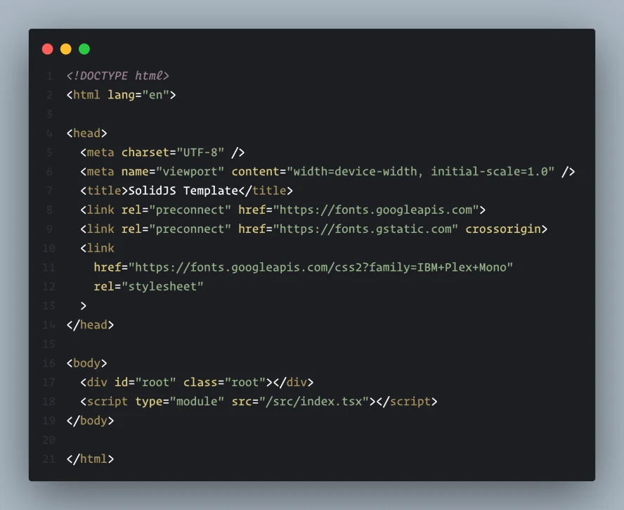

#### SCSS
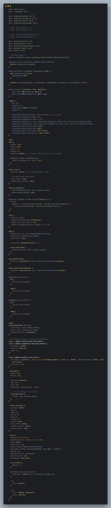

#### SASS
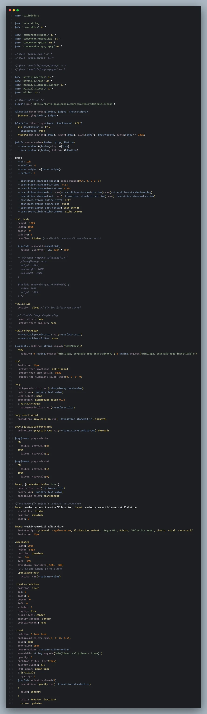

#### JS
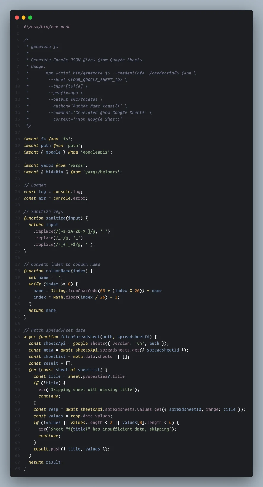

#### DART
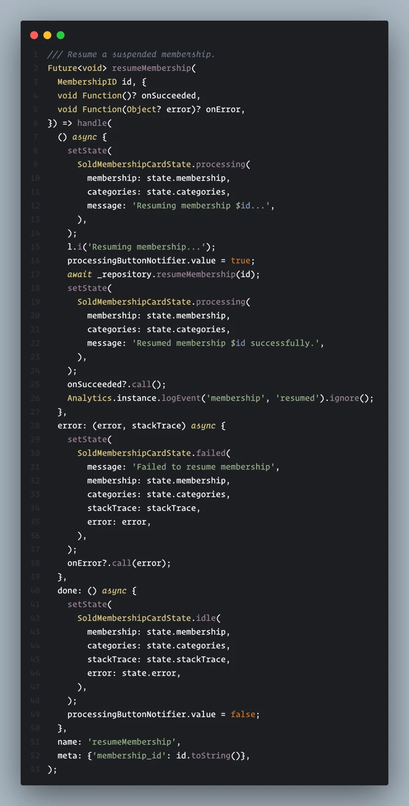
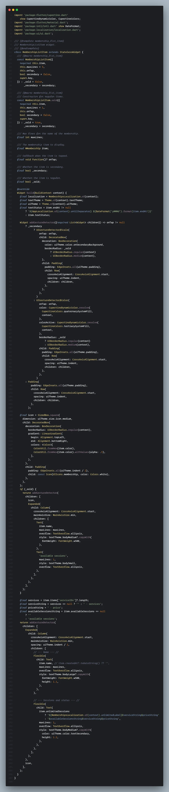

#### GO
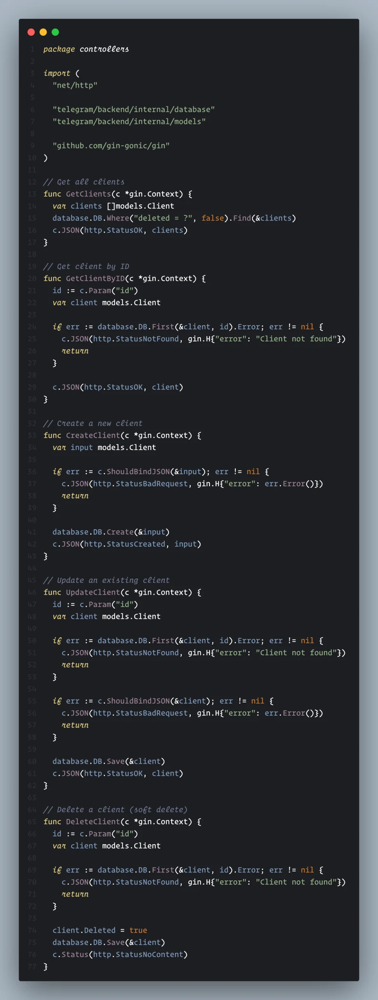

#### PYTHON
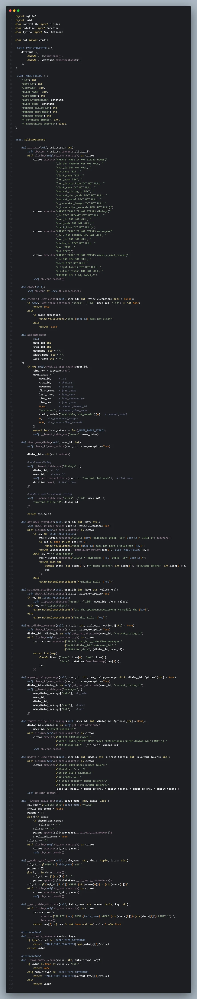

#### RUST
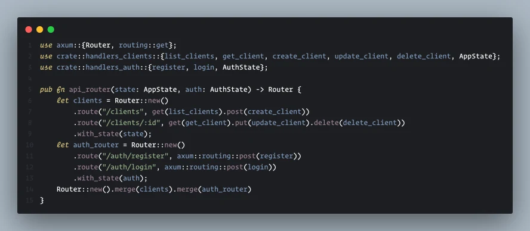
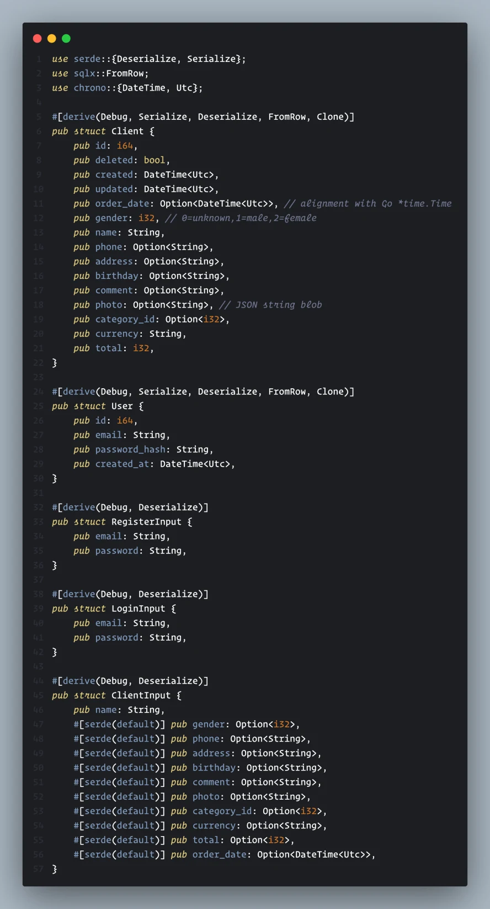

#### TOML
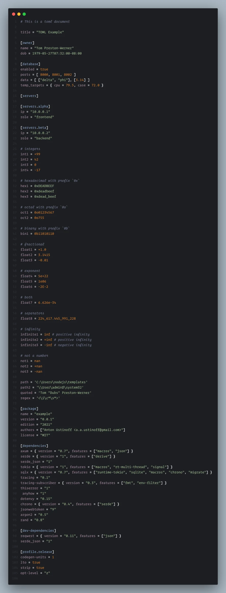

#### JAVA
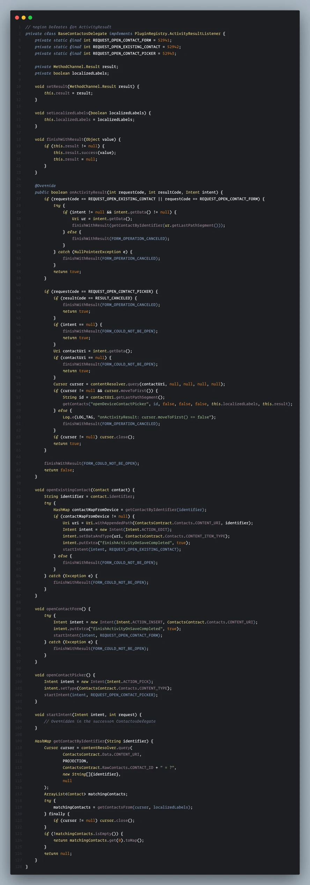

#### JUSTFILE
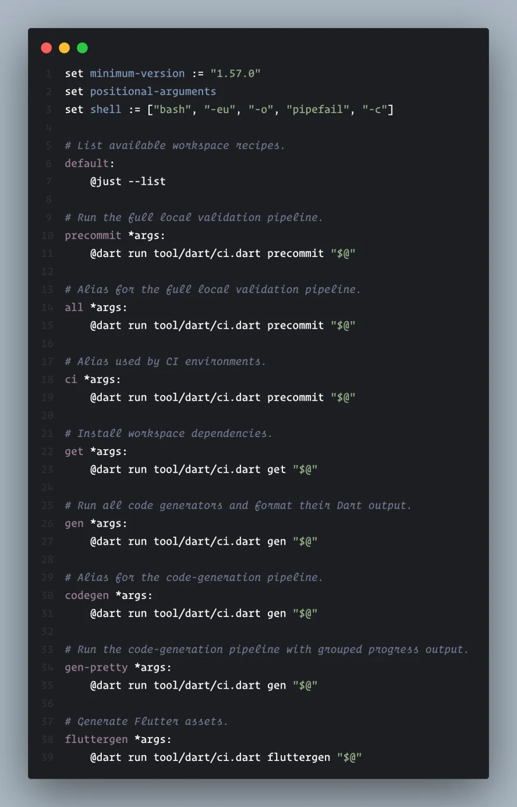

#### SQL
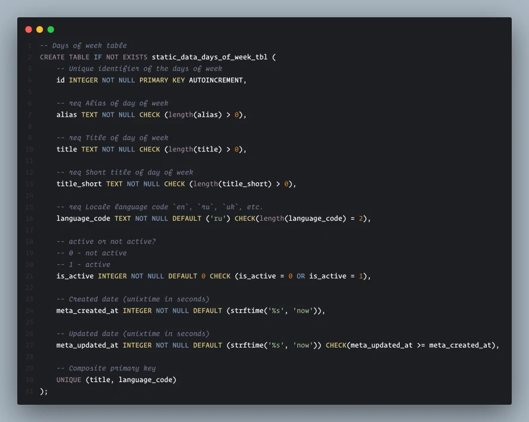

#### ENV
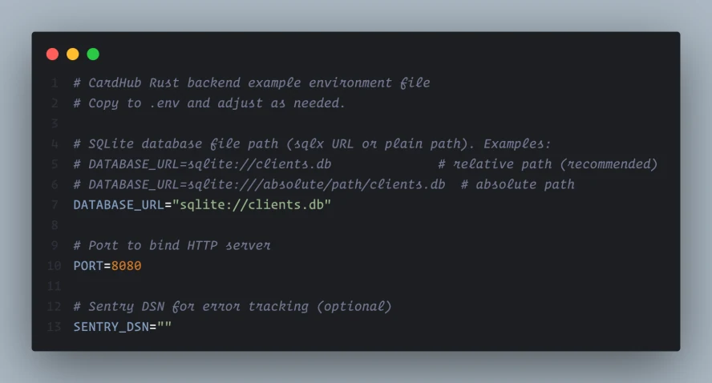
