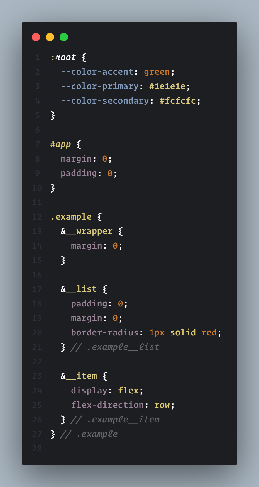

# CodePen Theme

## Description

Custom theme for Visual Studio Code. Compatible with .HTML, .CSS, .JS, .JSX, .DART

## Installing

This extension is available for free in the [Visual Studio Code Marketplace](https://marketplace.visualstudio.com/items?itemName=`ziqq`.codepen-theme)

## Screenshoots

#### HTML

#### HTML with Nunjucks

#### SCSS

#### JavaScript

#### DART

